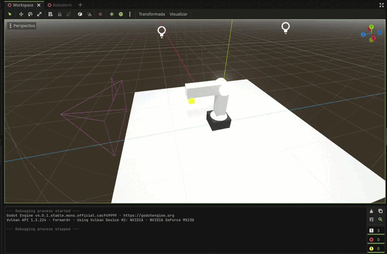
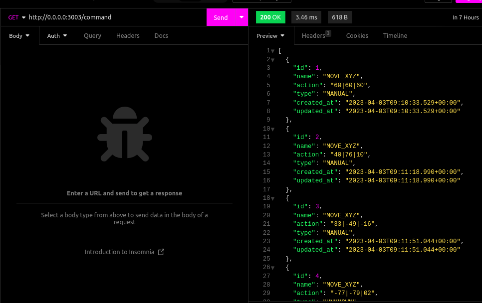
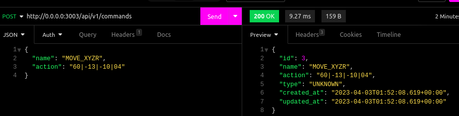

# Rustobot Simulator

Open source simulator that integrates Automation and Information Technologies, allowing to control the intelligent robot Dobot Magician Lite in a simulated way using Rust and Godot engine.

## Goals of project

Backend:

- [x] *Create a REST API to receive commands for simulation and frontend* (Temporary solution).
- [x] Implement a database to manage the history of the simulation and commands.
- [ ] Create a websocket to replace the REST API and send the data realtime ( without request delay ).

Frontend:
- [x] Create a interface to send commands to the backend.
- [x] Show the values of simulation in the interface.
- [ ] Create a interface to manage the simulation history.
- [ ] Implement Editor code to send commands to the backend with Lua or GDscript.

Simulator:
- [x] Create a simulator to simulate the robot with X, Y, Z and R values.
- [x] Simulation self update with the values of the backend, every time ( not realtime ).
- [ ] Realtime simulation with the values of the backend.

## Setup environment for development

### Clone the repository

```bash
git clone git@github.com:ViniciosLugli/rustobot-simulator.git
```

### Set the environment variables (.env)

Is necessary to create a file called `.env` in the folder of each workspace, and set the environment variables from template:

### Server

```bash
# Database ( default of postgres docker image )
DATABASE_HOST = "localhost"
DATABASE_PORT = 5432
DATABASE_USER = "postgres"
DATABASE_PASSWORD = "postgres"
DATABASE_NAME = "rustobot"

DATABASE_URL = postgresql://${DATABASE_USER}:${DATABASE_PASSWORD}@${DATABASE_HOST}:${DATABASE_PORT}/${DATABASE_NAME}

# API
WORKERS = 2

# App
RUST_LOG = "debug"
```

Final path of the file: `server/.env`

_💊 Yes, currently is only needed to set the environment variables for the server workspace_

### Interface

The interface workspace has one configuration file, the `Trunk.toml`, that is used to configure the build of the project, the file is located in the root folder of the project, and the default configuration is:

```toml
[build]
dist = "dist/"
target = "index.html"

[serve]
address = "0.0.0.0"
port = 8080
```

Is not necessary to put the environment variables in the file, because the variables are already in [interface/Trunk.toml](./interface/Trunk.toml) path, but if you want to change the default configuration, you can do it in the file.

### Install docker

You can find the installation instructions for your operating system here:

1.  docker: https://docs.docker.com/get-docker/

_💡 Docker compose is already included in the docker installation_

#### Verify installations

```bash
docker --version
```

```bash
docker compose version
```

_🍀 Tip: Is recommended use the docker-desktop app to manage and monitor the containers if you are not familiar with docker CLI_

### Running the container

In the root folder of the project, run the following command to run all the containers:

```bash
COMPOSE_PROFILES=development docker compose up
```

The COMPOSE_PROFILES environment variable is used to define the profiles that will be used to run the container. All the profiles are defined in the [docker-compose](./docker-compose.yml) file:

-   `development`: runs the container in development mode ( with local database )
-   `production`: runs the container in production mode ( without local database)
-   `test`: runs the container for test workspaces

_🍀 Tips: If you want to run the container in the background, use the `-d` flag, and if you need to rebuild the container, use the `--build` flag after the command, see more in the [docker-compose documentation](https://docs.docker.com/compose/reference/up/) documentation_

#### Last tested docker version:

-   Docker version 23.0.1
-   Docker Compose version v2.15.1 with yml version 3.8

#### For modifications in the code

the [docker-compose](./docker-compose.yml) is configured to run the each workspace container, currently the workspaces are:

-   [interface](./interface/Dockerfile)
-   [server](./server/Dockerfile)

_🤘 Reminder: If you need modify the Dockerfile of the workspaces, you need to rebuild the container with the `--build` flag, to take effect the changes, see more in the [docker-compose documentation](https://docs.docker.com/compose/reference/up/) documentation_

### Simulator engine:

### Setup
Downloda the Godot4 with C# suport from [here](https://godotengine.org/download), and follow the C# SDK / tools setup from [here](https://docs.godotengine.org/en/stable/getting_started/scripting/c_sharp/c_sharp_basics.html).


### Running the simulator
Open the project in Godot4, using the file in [simulator](./simulator/project.godot) folder to import the project, and run the project.

By default the godot engine will compile the project, and run the simulator. The current API url is set to `0.0.0.0:3003`(_Same as Backend_), but you can change it in the [simulator](./simulator/sources/Workspace.cs) folder.

Example of the simulator running:




### API Documentation
Currently the server is using the REST API to send the commands to the simulator, and the simulator is using the REST API to get the values of the simulation. But the idea is to use the websocket to send the data realtime, without request delay...

#### Routes:

-   `GET /api/v1/commands`: Get history of commands, in list, with the values of the simulation. Example output:
```json
[
	{
		"id": 1,
		"name": "MOVE_XYZR",
		"action": "60|60|60|12",
		"type": "MANUAL",
		"created_at": "2023-04-01T09:10:33.529+00:00",
		"updated_at": "2023-04-01T09:10:33.529+00:00"
	},
	{
		"id": 2,
		"name": "MOVE_XYZR",
		"action": "40|76|10|05",
		"type": "MANUAL",
		"created_at": "2023-04-01T09:11:18.990+00:00",
		"updated_at": "2023-04-01T09:11:18.990+00:00"
	}
]
```

- `POST /api/v1/commands`: Create a new command in database for simulation, with the values of the simulation. Example input:
```json
{
	"name": "MOVE_XYZR",
	"action": "60|60|60|15"
}
```


📺 _Action is the values of the simulation, in the format `X|Y|Z|R`, where `X`, `Y`, `Z` and `R` are the values of the simulation._

Examples in Insomnia manual test:



